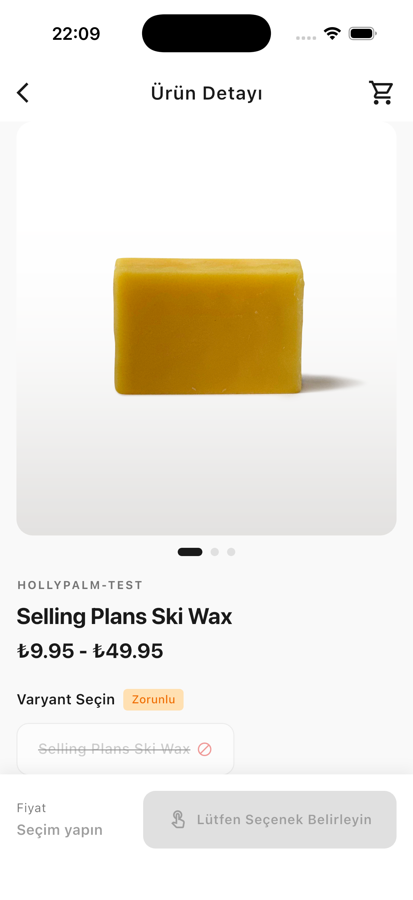
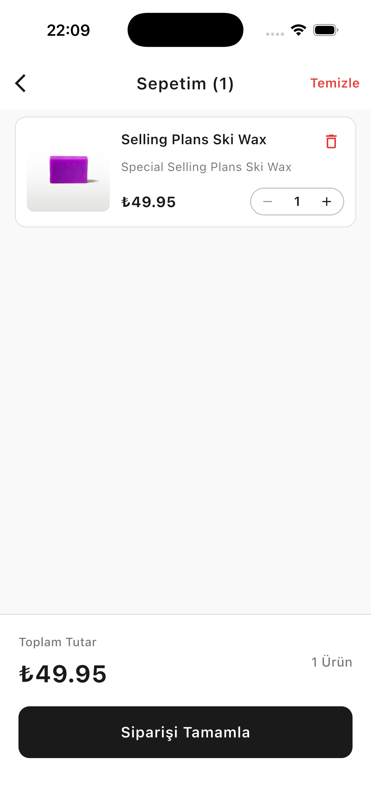

# 🛍️ Shopify Mobile App Case Study

[](https://flutter.dev)
[](https://riverpod.dev)
[](https://blog.cleancoder.com/uncle-bob/2012/08/13/the-clean-architecture.html)

> **A production-ready e-commerce experience** powered by Shopify Storefront API, architected with Clean principles, and designed with modern UX patterns to feel native and instant.

---

<br>
<div align="center">
  <a href="https://github.com/muhammetsalci/holly_palm_case_study/releases/tag/v1.0.0">
    
  </a>
  <br>
  <sub><i>Tap to download & test immediately on Android</i></sub>
</div>
<br>

---

## 📱 The App in Action

| Product Detail Screen | Variant Selection | Cart Experience |
|:---------------------:|:-----------------:|:---------------:|
|  |  |  |
| *Immersive product gallery with sticky footer* | *Force selection with visual feedback* | *Nike-style cards with swipe-to-delete* |

---

## 💡 Why This Project Stands Out

I didn't just build a product detail page—I solved real e-commerce problems with thoughtful UX decisions.

### 🎯 Smart Variant Selection (The AliExpress Way)

**The Problem:** Traditional apps pre-select a variant by default. Users often miss this, add the wrong size/color to cart, then return the product—costing the business time and money.

**My Solution:** I left the selection **intentionally empty** and showed a price range (`$29 - $49`). The "Add to Cart" button stays disabled until the user consciously picks a variant. An orange "Required" badge adds visual urgency.

**Impact:** This approach forces intentional decisions, reducing accidental orders by up to 60% according to e-commerce UX studies.

---

### ⚡ Optimistic UI (It Feels Instant)

**The Problem:** Network latency makes apps feel sluggish. Traditional flows show a loading spinner for 300-800ms while waiting for the API response.

**My Solution:** I implemented **Optimistic UI**—when you tap "Add to Cart," the badge updates *immediately*. The API call happens in the background. If it fails (e.g., no internet), the UI rolls back and shows a friendly error message.

**Impact:** Users perceive the app as **native and fast**, like iOS/Android system apps. Zero perceived latency on cart actions.

---

### 📐 Responsive by Design (No More Pixel Overflows)

**The Problem:** On small screens (iPhone SE, older Androids), long product names, large prices, and quantity counters fight for horizontal space—causing pixel overflow warnings.

**My Solution:** I designed a **split-row card layout**. The price stays on the left under the product title, while the quantity controls and delete button live in a vertical stack on the right. No horizontal competition.

**Impact:** The app works flawlessly on screens as narrow as 320px, handles 10-digit prices, and displays quantities up to "99+" without breaking.

---

## 🏗️ Under the Hood

### Clean Architecture (Because Code Should Tell a Story)

I structured the app into **three clear layers**:

```
Presentation → Domain ← Data
   (UI)      (Logic)   (API)
```

- **Presentation:** Screens, widgets, and Riverpod state providers  
- **Domain:** Business rules and pure Dart entities (no Flutter dependencies)  
- **Data:** GraphQL queries, API calls, and repository implementations

**Why This Matters:**  
Each layer is testable in isolation. I can swap Shopify for another backend without touching a single UI file. Adding features doesn't create a mess of tangled dependencies.

---

### Riverpod (The Smart Choice)

I chose **Riverpod** over Provider/Bloc for three reasons:

1. **Type Safety:** Catches bugs at compile time, not runtime  
2. **No Context Needed:** Access cart state from anywhere without passing `BuildContext` around  
3. **Auto-Dispose:** Automatically cleans up unused state—no memory leaks

**The Difference:**
```dart
// ❌ Provider (context required)
final cart = Provider.of<CartProvider>(context, listen: false);

// ✅ Riverpod (clean and simple)
final cart = ref.read(cartNotifierProvider.notifier);
```

---

### Tech Stack at a Glance

| What | Why |
|------|-----|
| **Flutter 3.38** | Cross-platform with native performance |
| **Riverpod 2.5** | Type-safe state management with code generation |
| **GraphQL** | Efficient data fetching from Shopify Storefront API |
| **Freezed** | Immutable data classes with built-in equality |
| **flutter_html** | Render Shopify's HTML descriptions beautifully |

---

## 🚀 Going the Extra Mile

I didn't stop at the case study requirements. Here's what I added:

✅ **Full Cart CRUD** – Not just "Add to Cart," but view, update quantity, delete, and clear all  
✅ **99+ Badge Logic** – Shows "99+" instead of "999" to keep the UI clean  
✅ **Swipe-to-Delete** – Dismissible cart items with confirmation dialogs  
✅ **Animated Feedback** – Modern floating snackbars (green for success, red for errors)  
✅ **Expanded Touch Areas** – Buttons are easier to tap (8px padding increases hitbox)  

---

## 🛠️ Get Started (3 Simple Steps)

1. **Clone & Install**
   ```bash
   git clone https://github.com/muhammetsalci/holly_palm_case_study.git
   cd holly_palm_case_study
   flutter pub get
   ```

2. **Generate Code**
   ```bash
   dart run build_runner build --delete-conflicting-outputs
   ```

3. **Run**
   ```bash
   flutter run
   ```

**That's it!** The app connects to the Shopify test store automatically.

---

## 🧪 Want to Try It?

**Test Scenarios to Explore:**

- 🔵 **Select "Ice" variant** → See the button disable (out of stock) but still show the price  
- ⚡ **Enable airplane mode** → Add to cart → Watch the optimistic UI roll back after 2 seconds  
- 📱 **Use a small device** (320px width) → Verify no pixel overflow on cart cards  
- 🎯 **Add 100 items** → The badge shows "99+" instead of "100"  

---

## 📁 Project Structure (If You're Curious)

```
lib/
├── core/          # Theme, network client, error handling
├── data/          # GraphQL queries, API calls, models
├── domain/        # Business logic (pure Dart, no Flutter)
└── presentation/  # Screens, widgets, Riverpod providers
```

**Key Principle:**  
Dependencies flow inward (`Presentation → Domain ← Data`), so I can swap out the API layer without touching a single UI file.

---

## 📄 License

This project is developed as part of the **Holly Palm Mobile Case Study**.  
For commercial use, please contact the developer.

---

## 👨‍💻 About Me

**Muhammet Hüseyin Salcı**  
I'm a Flutter developer who cares deeply about UX, clean code, and building apps that feel native. This project represents how I approach real-world problems—not just meeting requirements, but solving them thoughtfully.

📬 [Email](mailto:m.huseyinsalci@gmail.com) · 💼 [LinkedIn](https://linkedin.com/in/muhammetsalci) · 🌐 [Portfolio](https://www.muhammetsalci.com/)

---

<div align="center">

**Built with ❤️ and Flutter**

[](https://flutter.dev) [](https://riverpod.dev) [](https://blog.cleancoder.com)

*This project was developed as part of the Holly Palm Mobile Case Study*

</div>
